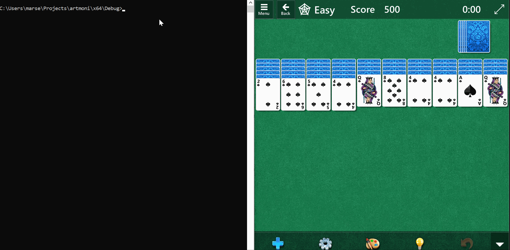

# artmoney-tribute
Scan process memory and rewrite some memory regions

# Motivation
C++ and WINAPI practice. Special thanks to [Jeffty Ritcher "Windows via C/C++"](https://www.amazon.com/Windows-via-softcover-Developer-Reference/dp/0735663777)

# History
When I was a kid I used to play computer games a lot and a program called [artmoney](http://www.artmoney.ru/) was very helpful.
It could make Tommy Vercetti rich right from the start of the game.
The artmoney was pure magic for me, but now I better understand how computer works and I am able to reproduce this magic. 
It simply looking for the desired memory region which stores some quantity and resets its value.   

# Demo

